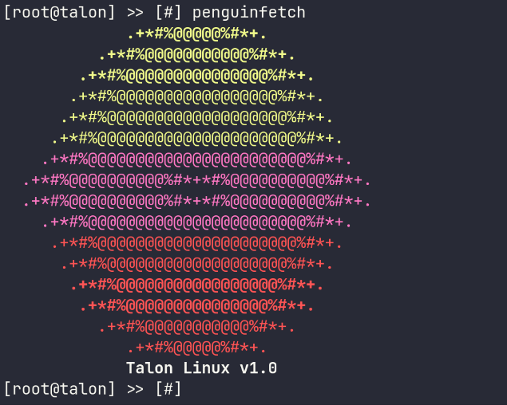

# Talon OS Simulation



> **⚠️ Under Development** — This project is still actively receiving updates. Some components (e.g. DXE) are stubs/skeletons and not yet fully implemented.

A user-space simulation of the Talon Linux operating system environment, written primarily in C++ with C components. It features a shell interface, a simulated bootloader, a simulated kernel boot sequence, UEFI firmware emulation, a driver execution environment (DXE), driver registry, NVRAM simulation, initramfs simulation, virtual filesystem subsystems, and a basic calculator.

## Features

- **Shell** (`main.cpp`) — A `[root@talon]` command-line REPL supporting commands like `reboot uefi`, `penguinfetch`, `cat proc/cpuinfo`, `cat proc/gpuinfo`, `pacman -Syu`, `free -h`, `df -h`, `iwctl`, `root locate`, `which`, `whoami`, and more
- **Bootloader** (`bootloader.cpp`) — Simulated Talon Bootloader with boot option selection
- **Kernel** (`kernel/kernel.c`) — Simulated Linux kernel boot sequence with driver-loading messages and cross-platform sleep
- **Initramfs** (`initramfs.cpp`) — Simulated initial RAM filesystem stage
- **UEFI** (`uefi.cpp`) — Mock UEFI setup screen showing boot order, secure boot, XMP, and TPM status
- **DXE** (`dxe/dxe.cpp`) — Driver Execution Environment with 16+ driver initialization stubs (CPU, RAM, PCIe, NVMe, SATA, GPU, Ethernet, WiFi, USB, audio, and more)
- **Driver Registry** (`driver_registry.cpp`) — Simple device driver registration system
- **NVRAM** (`nvram.cpp`) — UEFI NVRAM variable stubs (secure boot, boot entry, TPM 2.0)
- **SEC** (`sec.cpp`) — UEFI Security (SEC) phase stub
- **Virtual Filesystem** (`filesystem/`) — Simulated `/proc/cpuinfo` (Intel Core Ultra 9 285K) and `/proc/gpuinfo` (Nvidia GeForce RTX 5090)
- **Hardware Detection** (`system/hardware/system.cpp`, `hardware/ram/`) — Hardware profile stubs and RAM communication simulation
- **Logo** (`logo.cpp`) — ASCII art "Talon Linux" branding displayed by `penguinfetch`
- **Arch UEFI** (`arch-uefi/`) — Experimental Arch Linux UEFI simulation (not a real bootloader). Changing boot order in UEFI will boot into this. Unofficial, may or may not be included in the final release.

## Download

> **Pre-built binaries are available for every release.** No need to compile.

[**Download the latest release**](https://github.com/goldstac/talon-os-simulation/releases)

Each release includes:
- `talon-os-linux` — Linux
- `talon-os-windows.exe` — Windows
- `talon-os-macos` — macOS

---

## Project Structure

```
├── main.cpp              # Entry point and shell command dispatch
├── bootloader.cpp / .h   # Simulated Talon Bootloader
├── uefi.cpp / .h         # UEFI firmware simulation
├── driver_registry.cpp   # Driver registration stubs
├── nvram.cpp / .h        # UEFI NVRAM variable simulation
├── sec.cpp               # Security (SEC) phase stubs
├── initramfs.cpp         # Simulated initramfs stage
├── logo.cpp / .h         # ASCII art Talon Linux logo
├── kernel/
│   ├── kernel.c          # Simulated kernel boot sequence
│   ├── kernel.h          # Kernel function declaration
│   └── compat.h          # Cross-platform sleep macro
├── dxe/
│   ├── dxe.cpp           # DXE driver initialization stubs
│   └── dxe.h             # DXE declarations
├── filesystem/
│   ├── bin/
│   │   ├── penguin       # Placeholder /bin/penguin
│   │   ├── calculator    # Placeholder /bin/calculator
│   │   ├── bash          # Placeholder /bin/bash
│   │   └── zsh           # Placeholder /bin/zsh
│   ├── boot/flash/
│   │   └── flash.cfg     # Flash boot configuration
│   └── proc/
│       ├── cpuinfo.cpp   # Simulated /proc/cpuinfo
│       └── gpuinfo.cpp   # Simulated /proc/gpuinfo
├── hardware/
│   └── ram/
│       └── ram_talk.cpp  # RAM communication simulation
├── system/hardware/
│   └── system.cpp        # Hardware detection stubs
├── arch-uefi/
│   ├── main.c            # Arch UEFI simulation boot menu
│   ├── arch.cpp          # Arch UEFI simulation shell
│   └── arch.h            # Arch UEFI simulation header
├── extras/               # Miscellaneous text files
├── bin/                  # Build artifacts
├── compile.sh            # Compile utility objects
├── quick.sh              # Quick build + run (Linux)
├── run.sh                # Full build + run (Linux)
├── run.bat               # Build + run (Windows)
└── .github/workflows/    # GitHub Actions CI
```

## Releases

This project uses **tagged releases** with pre-built binaries across Linux, Windows, and macOS.

### Creating a release

```bash
git push origin main                  # push your changes
git tag v0.1.0                        # tag the version
git push origin v0.1.0                # triggers the release workflow
```

Tags containing `alpha`, `beta`, `rc`, `preview`, `dev`, or `test` are automatically marked as **pre-releases** on GitHub.

Each release includes:
- `talon-os-linux` — Linux ELF binary
- `talon-os-windows.exe` — Windows PE binary
- `talon-os-macos` — macOS binary

### Updating the changelog

Use opencode to auto-generate the changelog for a new version:

```
opencode update changelog
```

This reads recent commits, categorizes them, and updates `CHANGELOG.md`.

## License

AGPL-3.0
